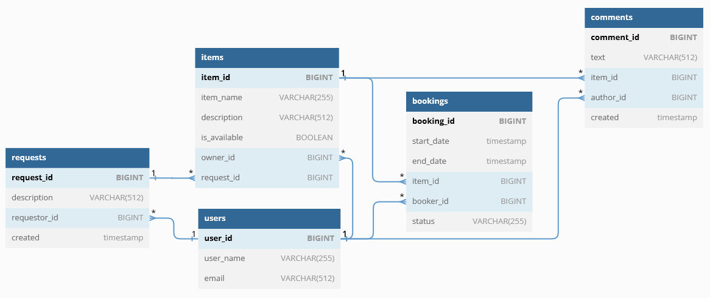

# java-shareit

Пересоздание БД:
```postgresql
DROP USER IF EXISTS test;
CREATE USER test WITH SUPERUSER PASSWORD 'test';
DROP DATABASE shareit;
CREATE DATABASE shareit WITH OWNER test;
```
Удаление таблиц и сиквенсов:
```postgresql
DROP TABLE IF EXISTS comments;
DROP SEQUENCE IF EXISTS comment_seq;
DROP TABLE IF EXISTS bookings;
DROP SEQUENCE IF EXISTS booking_seq;
DROP TABLE IF EXISTS items;
DROP SEQUENCE IF EXISTS item_seq;
DROP TABLE IF EXISTS requests;
DROP SEQUENCE IF EXISTS request_seq;
DROP TABLE IF EXISTS users;
DROP SEQUENCE IF EXISTS user_seq;
```